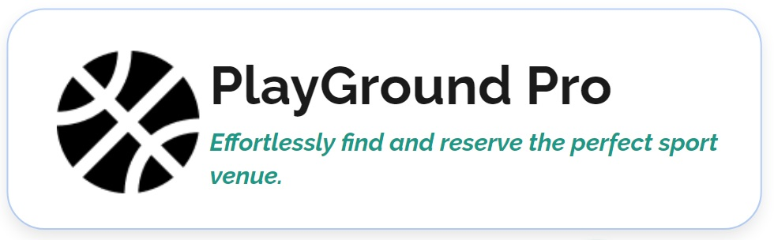

 

<h1 style="display-inline:block">PlayGround Pro</h1>

Capstone Program Immersive Alterra Academy  

## About PlayGround Pro
Many sports enthusiasts struggle to find accurate and up-to-date information about available sports venues in their area. This lack of centralized information makes it time-consuming and inconvenient to search for suitable venues. That's why we created PlayGround Pro.

PlayGround Pro is a platform designed to connect sports enthusiasts with sports arena owners. This platform aims to enhance public enthusiasm for sports and, of course, increase profits for the arena owners.
PlayGround Pro have tags: Effortlessly find and reserve the perfect sport venue.

## Collaboration
- 👨‍💻 [Frontend](https://github.com/playground-pro-project/FE_PlaygroundPro)
- ⚙  [Backend](https://github.com/playground-pro-project/playground-pro-api)
- 🔎 [Automation API](https://github.com/playground-pro-project/QE-API)
- 🔎 [Automation Web](https://github.com/playground-pro-project/QE-Web)

## Report

## Tools

Manual Testing

      
      
Test Case Management

      
      
Automation Testing

      
      
      
      
      
      
      
      
Management Project

      

## Team Quality Assurance Engineer:
* [Muhammad Faruqi Rabbani](https://github.com/ukifar)   
* [Derin Malsa](https://github.com/derin2024)   

## How to Run This Project:
* Run this project from IDE:
    * Open this project from your IDE
    * Open your IDE terminal
    * Type and run this command on your IDE terminal:
      > mvn clean verify
######
* Run this project from terminal:
    * Open your terminal
    * Change your directory to where you place this project on your machine using this command:
      > cd your-project-directory-path
    * Type and run this command on your terminal:
      > mvn clean verify
